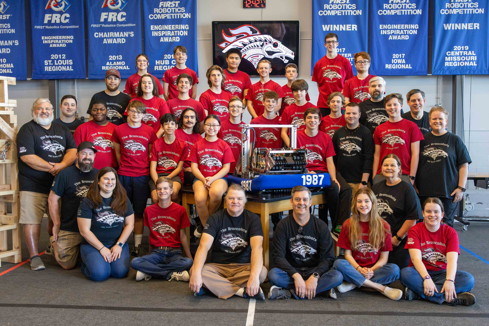

<link rel="stylesheet" href="/assets/css/buttonHover.css">

<h1 style="text-align:center">
    Welcome!
</h1>

 We are the Broncobots, Team 1987, based out of Lee's Summit, Missouri. The team is made up of many students attending [Lee's Summit North High School](https://lsnhs.lsr7.org/), 5 coaches, several amazing mentors, and multiple gracious corporate sponsors! Our team is dedicated to [FIRST](https://www.firstinspires.org/) (For Inspiration and Recognition of Science and Technology), our community, and working hard to encourage [STEM](https://www.kcstem.org/) (Science, Technology, Engineering, and Math) topics within our community. The Broncobots are looking forward to competing in each and every FRC Season. To learn more about our team, check out the About Us section of our website!

[//]: # (We are building our 2024 robot and updating our website with current content.)

**Check back here often for events, competitions, and general team information!**

<h1 style="font-size:64px;font-family:Rockwell, Roboto, sans-serif; text-align:center">
    Broncobots are
  
</h1>

---

    

---

 

<h2 style="color:maroon; text-align:center; font-family:Rockwell, Roboto, sans-serif;">About us</h2>

<buttonhover class="noWrap full-rounded" onclick="teamFocus()">Team Focus

</buttonhover>
<buttonhover class="noWrap full-rounded" onclick="missionStatement()">Mission Statement

</buttonhover>
<buttonhover class="noWrap full-rounded" onclick="teamHistory()">Team History

</buttonhover>

 
      The Broncobots are dedicated to helping the future through the recognition and advocacy of science, technology, engineering, and math. As FIRST participants, we strive to build a community devoted to education, innovation, and inspiration. By creating strong partnerships with mentors, teachers, and sponsors, we encourage communication and leadership as crucial parts of team success.  

 
      

         The focus of our team has been to reach out to our community in every way possible. We have attended school carnivals, school presentations, bingo raffles, Boy Scout meetings, school board meetings, and business meetings. We have been featured numerous times in publications, including three local newspapers, Honeywell newsletters, and even two books: FIRST Robotics: Rack N Roll and FIRST Robots: Behind The Design. The team created a video as an introduction to FIRST for the Lee's Summit community that aired on the local government channel and published a book about our team and our history.
      
        In our own school, we have hosted booths at Freshmen Orientation Day, sponsored "Math and Science Teacher Appreciation Day," set up booths at football games, participated in Safe Halloween, and set up FIRST Robotics displays throughout the year. In cooperation with the two other Lee's Summit robotics teams, we have held PR meetings to schedule banquets, school visits, open houses, and community outreach projects. For three weeks this past summer, we sponsored robotics and engineering camps for elementary students.
      
        We've made our name known throughout the community in various ways. We have presented at numerous Lee's Summit elementary schools, in addition to Lee's Summit middle schools, and a private Catholic school in a neighboring city. We have attended and presented at meetings for the Rotary Club, the Optimist Club, the National Tool and Machining Association, the Lee's Summit Economic Development Council, and the Kauffman Foundation. We also were excited to give presentations at Gail's Harley Davidson, Honeywell, the Engineering and Science Summit Institute at Kansas State University, and the Lee's Summit Chalk Walk. Together with the other two Lee's Summit robotics teams our team rotated staffing a booth at Downtown Days to reach out to all Lee's Summit citizens.
      
        Over four years, we have sent over 1,500 letters to government officials. In 2008, there was a "Lee's Summit Robotics Day" proclamation from the mayor, and Governor Matt Blunt officially recognized and commended the FIRST Robotics Competition in the state of Missouri. Along with starting a mail campaign to government officials (fifteen different officials and federal offices), took the classic Flat Stanley and combined it with the spirit of FIRST to start our Flat Creation Campaign. This was designed to reach people outside our direct area of influence, like families and friends from other states and countries. During its time traveling, Flat Mammoth (from our 2008 Flat Creation Campaign) has visited a second grade classroom, attended a robot-themed movie night, enjoyed the warm weather in Honduras, and sat in the Missouri House of Representatives! 
    

 
  

     Over the years, the Broncobots have had many significant achievements. We've attended over {{ site.data.home_callouts.items[1].title }} competitions over the years, from Regionals to World Championship. Team 1987 has also competed in Off-Season competitions such as Ozark Mountain Brawl, Lee's Summit's CowTown ThrowDown and Indiana Robotics Invitational (IRI). We haven't kept quiet about what we do either. You can find the Broncobots spreading the message of FIRST within our community by hosting booths at Missouri State Fair, Lee's Summit's Downtown Days, Oktoberfest, Kansas City Maker Faire, School Registration day, Freshmen Transition Day and You Belong Club event. The team has been featured in countless newspaper articles, been on TV, and have had two robots written about and published in two books. We've also initiated letter campaigns, media broadcasts, toiletry drives for a Domestic Abuse shelter, and much more. Team 1987, The Broncobots has accomplished much since our founding year.
  

